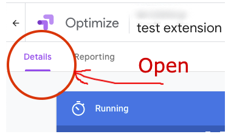
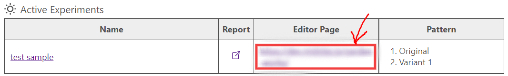
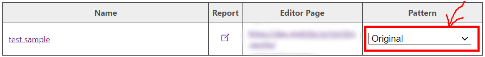

# optimize-ab-selector

This is a chrome extension, allows you to select variants of A/B testing by the Google Optimize.

## Usage

1. First, open the "Details" tab on the the Google Optimize page displaying a experient.  

2. The Optimize AB Selector parse the test configuration from this page. When the parsing is completed successfully, the Optimize AB Selector icon will display a "!" mark.  

3. Click the Optimize AB Selector icon to display a parsed test configuration. Click a URL on the Editor Page to open a page where you are running a test.  

4. You can change a pattern on the test page. Select a pattern you want to change and click the Apply button.  

## Terms
- [Terms and conditions](docs/terms-and-conditions.md)
- [Privacy policy](docs/privacy-policy.md)

## License
MIT
